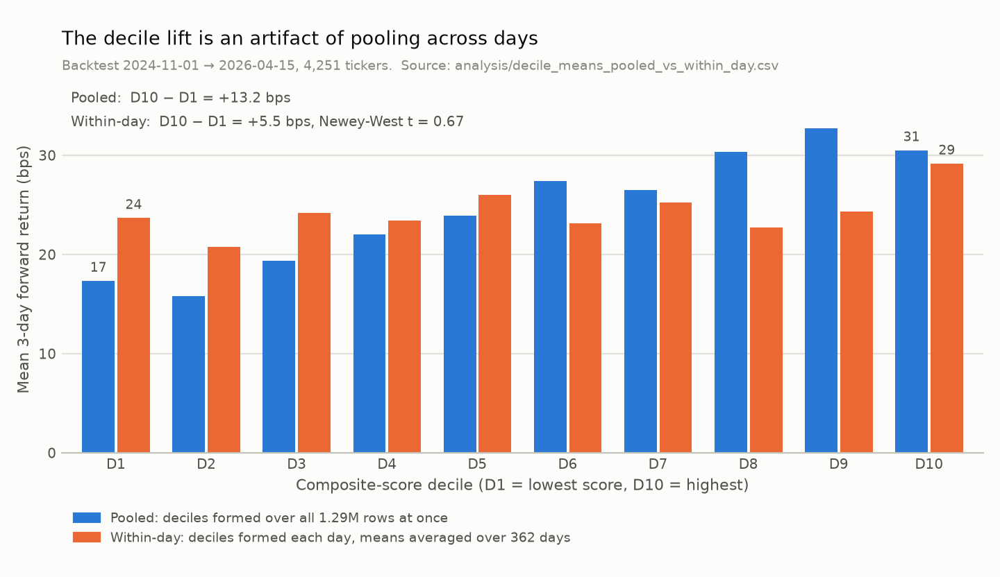
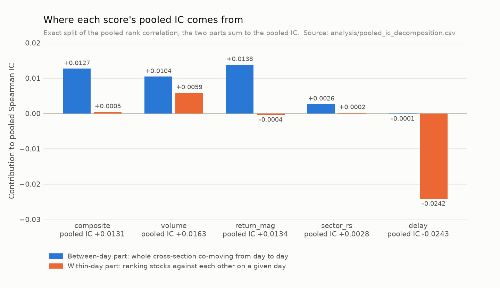

# Arconian: a small-cap information-lag strategy, built, tested, and closed

*Quinn Lambert, September 2026*

## 1. TL;DR

Arconian was a rule-based system I designed and built in 2026 to trade short-term drift in U.S. small caps with slow information diffusion, scored by a five-signal composite. I built it with AI-assisted development from a whitepaper I designed: about 12,000 lines of Python plus tests. A backtest over 1.29 million stock-days gave a pooled IC of +0.013, which I read as a weak but real signal; it was a between-day time effect. Within each day, the composite's IC against raw returns averages −0.003 (Newey-West t = −0.54). Because the strategy traded in the direction of the day's move, I then pre-registered a signed-return test using CRSP to recover direction: on the 288 days my CRSP access covers, the per-day IC is −0.004 (t = −1.18) and the top decile loses about 136 bps per trade after costs. By the rule I fixed in advance, the signal is dead, so I closed the project.

## 2. The thesis

Prices are supposed to absorb information instantly. In practice they absorb it at different speeds depending on who is watching. A stock with thin analyst coverage and little institutional ownership reacts to news, sector moves, and its own unusual trading activity more slowly than a large, heavily covered name. The academic literature I built on (Hong and Stein 1999; Hong, Lim and Stein 2000; Hou and Moskowitz 2005) documents this "slow diffusion" effect and finds that short-term momentum and post-event drift are stronger in exactly these neglected stocks.

Hou and Moskowitz made the idea measurable. Regress a stock's weekly returns on the market's contemporaneous weekly return, then regress them again adding the market's returns from the previous four weeks. The **delay score** is one minus the ratio of the two R-squared values. If lagged market returns explain a lot of a stock's variation that the contemporaneous return does not, the stock is slow to incorporate market-wide information, and its delay score is high. My whitepaper treated delay above 0.3 as the primary target zone.

The trading idea was to look, within that slow universe, for days when something unusual happened, and to hold for the 1–3 days it should take the price to finish adjusting. "Unusual" was scored by a composite of five signals, each expressed as a percentile rank against the stock's own trailing history so that they are comparable across stocks and require no distributional assumptions:

| Signal | Weight | What it measures |
|---|---|---|
| Volume surprise | 0.30 | Today's volume against 20-, 60- and 120-day trailing distributions |
| Return magnitude | 0.25 | Absolute one-day return against its 60-day distribution |
| Options flow composite | 0.15 | Put/call ratio, implied-volatility rank, volume-to-open-interest |
| Relative sector strength | 0.10 | Stock's 5-day return minus its sector ETF's, ranked over 60 days |
| Delay score | 0.10 | The Hou-Moskowitz score, recomputed monthly |

A retail-attention penalty was to reduce the composite for names already trending on social platforms or scanners, on the theory that the crowd's arrival compresses the delay window. Direction was to come from a separate confirmation layer (sign of the day's return, position against prior-day VWAP, options flow). Entries above a composite of 0.70 in high-delay names were the intended trades.

The whitepaper's effect-size expectations were design assumptions taken from the literature and then halved for post-publication decay: a gross edge of 100–200 bps per trade against an assumed round-trip cost of 120 bps for longs and 150 bps for shorts (75 bps at the whitepaper's low end), with 150 bps gross as the minimum worth trading. None of those figures was ever measured by this project. They are stated here so the reader can see what the tests below had to clear.

## 3. What I built

In early April 2026 I designed the strategy and worked with Claude to turn my notes into a whitepaper and a set of supporting specifications (module structure, database schema, configuration, testing rules). The thesis, the choice of signals, and the validation gates were mine; the AI did much of the drafting and filled out the detail. I then used Claude Code to generate the Phase 0 codebase from those documents and to carry out each later piece of work from a scoped written brief. The research questions, the acceptance criteria in each brief, and the calls about what the results meant were mine. I'm stating this plainly because it's how the project exists, and because the judgment calls are the part I think is worth showing.

The system ran as a scheduled daemon that scanned the universe three times a day, scored every name, logged the full feature vector for every candidate whether traded or not, and wrote to a SQLite database shared with a separate journaling dashboard.

| Component | Role | State at close |
|---|---|---|
| Universe manager | Six liquidity and size filters, a five-state membership machine, monthly refresh and daily check | Built and wired; 326 names seeded; several filters ran on synthetic inputs |
| Signal engine | Percentile-rank signals, composite, direction, exclusions, two-pass scan | Built and wired; options, earnings, EDGAR and retail components not functioning in production |
| Paper-trade state machine | Entry, 1.5×ATR stop, tiered take-profit, trailing stop, 3-day time stop | Built and wired |
| Risk engine | ATR sizing, VIX/IWM regime gates, sub-industry and Ledoit-Wolf correlation caps, CVaR stress, circuit breakers | Built in April, dead code until June, wired but switched off |
| Outcome collector | 3-day forward returns and triple-barrier labels for every logged signal | Wired; ran once |
| IC tracker | Spearman IC per signal every 60 trading days, segmented | Ran once, on an unusable cohort |
| Backtest | Norgate historical run approximating the live composite (options fixed at 0.5, no retail penalty) | Ran once; see §4 |

The code base is roughly 12,000 lines of Python outside tests and 6,600 lines of tests; at close, 491 tests are collected and 490 pass (one has a wall-clock dependency). Every external dependency is mocked in the suite, which mattered later: the suite was green through every production failure described in §5.

The validation plan had three gates. First, a survivorship-bias-free backtest using Norgate data with delisted names. Second, at least 80 trading days and 40 round-trip paper trades, evaluated on gross expectancy above 150 bps and net expectancy above zero after the cost model. Third, live trading at half the target risk per trade, with parallel paper tracking to decompose any paper-to-live gap. The project never passed the first gate, though I did not know that until September.

## 4. The first backtest and why it misled me

On April 20–21, 2026, I ran the backtest over a Norgate trial subscription. The trial's rolling data window meant the effective sample was **2024-11-01 to 2026-04-15**: 362 trading days, 4,251 tickers, 1,289,872 stock-day rows with a valid 3-day forward return. Each row carries the scores computed with the live code's signal and composite functions, with two differences from the live composite: the options signal was fixed at a neutral 0.5 and no retail-attention penalty was applied. Each row also carries the close-to-close return over the next three trading days. No parameter was fit to this data; the weights, the 0.70 threshold, the 0.3 delay cutoff, the 120 bps cost and the 0.02 IC bar were all fixed in advance by the whitepaper.

The pooled results looked like a weak signal that might be real. The composite's Spearman correlation with forward returns across all rows was +0.013. Sorting all rows into composite deciles, the mean 3-day return rose from +17.3 bps in the bottom decile to +30.5 bps in the top, a spread of +13.2 bps, and a rank correlation of the ten decile means against decile number was 0.96. The cell the whitepaper cared about most, top-decile composite among names with delay above 0.3, had 33,597 rows with a mean return of +55.2 bps. Against a 120 bps cost assumption that is −64.8 bps net, so the strategy was negative after costs even on its own terms. The delay score's pooled IC was −0.024, the wrong sign, which the analysis reframed as "delay is a filter, not a signal." The median of the thesis cell was +11.0 bps; the mean was carried by the tail.

I decided to proceed to paper trading anyway. My reasoning was that the backtest lacked several live-system features (options flow, retail-attention penalty, earnings exclusion, directional confirmation), so it should be a lower bound on live performance, and the monotone decile lift showed the composite carried some information. Both halves of that argument were wrong, in ways I only established months later. The "live" features were not functioning (§5), and the decile lift was not what I thought it was (§6).

When I audited the backtest code in September, four problems stood out. **Survivorship bias, reintroduced.** The script selected its symbol set with a quick prefilter that loaded only the last three weeks of the window and kept names with price at least $2 and 20-day dollar volume at least $5M as of April 2026. Any stock that had delisted, been acquired, or collapsed by then had no rows in that window and was dropped. The delisted universe I had bought Norgate access for was excluded by construction, and an earlier data-audit brief had looked at that exact function and waved it through. **Wrong universe.** Market-cap bounds were defined as constants and never applied, so the monthly universe was 3,094–4,097 names, essentially all liquid U.S. equities, rather than 150–300 small caps. **Inflated sample size.** Every ticker contributes a row every day and consecutive 3-day windows overlap by two days, so the 1.29 million rows are far from independent; every printed standard error and p-value treated them as if they were. **Multiple comparisons.** Five signals across five delay buckets, three subsets, three time periods, and fifteen return-cap cells were examined with no correction, and the headline cell was the one that best fit the thesis. The two bucket-level ICs that "cleared" the 0.02 bar are what twenty-odd comparisons of near-zero correlations produce by chance.

## 5. Operations: what broke

The paper trader went live on April 23 as an unattended auto-trade with no position cap, no deduplication and no risk engine, a step away from the whitepaper's "operator reviews each candidate" design that I made to collect data faster. After nearly two weeks in which the system was either down or asleep through its scheduled scans, I moved the machine to Linux on May 6 and started the daemon at 09:03 and again at 09:11 without stopping the first. Both instances ran the 09:35 scan and both opened trades; 51 positions were opened that day, some of them the same ticker at two prices.

The second failure was the dead-man's switch. The whitepaper specified a graduated escalation for a silent crash: widen stops after ten minutes, close everything after thirty. I implemented it against a 60-minute "no scan confirmed" timeout, but the scan schedule had gaps of 145 and 210 minutes between scans. So on every healthy trading day the switch concluded the system had crashed, widened every stop by one ATR (violating my own "never widen stops" rule), and then force-closed every open position with no exit price. Over May 6–12 it force-closed 101 of 107 trades. Six trades have a realized P&L, and they are duplicate entries of the same few underlying trades, all stopped out at stops that had already been widened. The broker API token then expired on May 11 with no alert, and I let the system sit. Scans wrote rows on nine trading days, plus a May 1 smoke test, against a plan of at least 80.

The third failure was documentary. My working notes described options flow, retail attention, earnings exclusion, and directional confirmation as present in the live system and used them to argue the backtest was conservative. In the database, the options signal was a constant 0.5 on every row that reached it, the earnings-exclusion class was never instantiated, the retail-attention score was NULL until April 30 and then consisted of a short-interest flag alone, and directional confirmation reduced to the sign of the one-day return because the VWAP input was never populated. The corporate-action adapter was constructed and never read. None of this was visible from the test suite because every external call was mocked.

In June I ran a read-only diagnostic audit of the whole repository and wrote up 36 findings, six of them blockers. A remediation session on June 23–24 fixed 27 of them across seven short-lived branches: the dead-man's switch became alert-only with a 20-hour timeout, four arithmetic bugs in the risk engine were corrected and the engine was wired behind a shadow/enforce switch, sector relative strength (which had been computed on misaligned windows in every production scan) was fixed, the earnings calendar was wired, the labeling bug that used the fill price as the stop barrier was fixed, and the test suite went from 361 to 491 passing. I left the risk engine switched off pending a soak period that never started. The daemon has not run since June 9.

## 6. The decisive tests

The question that actually mattered was whether the composite score ranks stocks. In September I recovered the backtest CSV from git history and asked it in two stages: the first measured the right thing against the wrong return, the second against the return the strategy actually traded.

### Stage one: per-day IC on raw returns

**Pooled versus within-day IC.** Every IC the project had ever computed was pooled: take all 1.29 million rows, rank the scores, rank the returns, and correlate. That is also how the decile table was built. Pooled correlation answers "across all stock-days, do higher scores go with higher returns?" It is satisfied just as well by *days* when the whole market had high scores and then rose as by *stocks* that scored high and then outperformed their peers. A trading strategy that picks a handful of names each day only earns the second kind. The right measurement is therefore cross-sectional: on each trading day, compute the Spearman correlation across stocks between score and forward return, then look at the distribution of those 362 daily values. Because consecutive 3-day forward windows overlap, the daily series is autocorrelated (0.34 at lag 1, 0.24 at lag 2), so the t-statistics below use Newey-West standard errors with three lags.

| Score | Mean daily IC | SD | Days positive | Newey-West t |
|---|---|---|---|---|
| Composite | −0.0028 | 0.075 | 49% | −0.54 |
| Volume | +0.0047 | 0.068 | 53% | +0.91 |
| Return magnitude | −0.0033 | 0.073 | 50% | −0.86 |
| Sector RS | −0.0006 | 0.040 | 53% | −0.23 |
| Delay (240 days) | −0.0281 | 0.111 | 41% | −2.63 |

The delay score needs a year of weekly returns, so it is NULL before May 2025 and its row covers 240 days rather than 362.

The composite ranks stocks no better than a coin flip: negative on 51% of days, mean indistinguishable from zero. The same holds inside every delay bucket; across 24 score-by-bucket cells the largest t-statistic is +1.63, and the two high-delay buckets the thesis is about are the weakest of the four. The decile spread tells the same story. Forming composite deciles within each day and taking the top-decile mean minus the bottom-decile mean gives an average of +5.5 bps with a Newey-West t of 0.67, positive on 51% of days, median +2 bps. Inside the thesis subset (delay above 0.3), the top decile beats the other nine by +16.5 bps with t = 1.64, far short of the 120 bps cost of a long trade (75 bps even at the whitepaper's low estimate). The one column with a detectable per-day IC was the delay score, negative at t = −2.63; stage two shows what that effect is.

**Where the pooled IC came from.** Spearman correlation is Pearson correlation on ranks, and the covariance of pooled ranks splits exactly into a between-day part (how the daily means of the ranks co-move) and a within-day part (how ranks co-move around their daily means). The two parts sum to the pooled IC.

| Score | Pooled IC | Between-day | Within-day |
|---|---|---|---|
| Composite | +0.0131 | +0.0127 | +0.0005 |
| Volume | +0.0163 | +0.0104 | +0.0059 |
| Return magnitude | +0.0134 | +0.0138 | −0.0004 |
| Sector RS | +0.0028 | +0.0026 | +0.0002 |
| Delay | −0.0243 | −0.0001 | −0.0242 |

Ninety-seven percent of the composite's pooled IC is between-day. On days when the whole cross-section had high volume and return-magnitude percentiles, the whole cross-section also tended to be higher three days later. The direct test confirms it: subtracting each day's cross-sectional mean return from every row and recomputing the pooled Spearman takes the composite from +0.0131 to −0.0006. The between-day relationship itself is weak (a rank correlation of +0.07 across 362 daily means) and would not be tradeable as a timing signal from these numbers. It looked large only because the pooled statistic counted each stock on the same day as an independent observation of one common shock, three to four thousand times per day. The decile "lift" and the +55 bps thesis cell are the same artifact seen through a different lens: the thesis cell's raw return is real, but the whole universe averaged +24.6 bps per 3-day window over this period and the high-delay subset averaged +35 bps, so most of the +55 is drift, not selection.

**What the biases mean for stage one.** The backtest's two structural defects both push the raw-return test in the strategy's favor. Survivorship bias keeps the names that were alive and liquid at the end and drops the ones that collapsed, which flatters forward returns most in exactly the high-volume, high-return-magnitude, volatile names the composite ranks highest. The missing market-cap filter adds thousands of larger, better-covered names in which the thesis predicts weaker effects, which dilutes but does not reverse a real signal. A sample tilted this way should, if anything, have shown a raw-return ranking effect more clearly than a clean one. It showed nothing.

### Stage two: the test that matched the thesis

Stage one had a flaw I did not see at first. Three of the four active signals (volume surprise, return magnitude and delay) are unsigned: they say something unusual happened, not which way. The strategy took direction from the sign of the day's return, long after an up day and short after a down day, and a drift thesis predicts that high scorers continue in that direction. Raw forward returns cannot show this, because a high scorer that rose and kept rising cancels one that fell and kept falling. The matching test uses the signed forward return: the sign of the day's return times the 3-day forward return.

The backtest CSV has no signed day-t return (return magnitude is stored as a percentile of the absolute move), so I matched the backtest's tickers to CRSP through WRDS and confirmed each match by requiring CRSP's compounded 3-day return to agree with the backtest's within 5 bps (median disagreement 4 × 10⁻⁷). Direction comes from CRSP's price-only day-t return (DLYRETX), which is what the live system saw. Before computing any statistic that related a score to a return, I committed a pre-registration of the test, sample and decision rule on its own (commit `daf7354` in my private development repository). The published file's git blob hash is `a1812569fe85b9b76bc0209eac3478d6581ac004`, which anyone can check with `git hash-object analysis/signed_test_preregistration.md`. The rule: the signal is alive only if the composite's per-day Spearman IC against signed returns has a Newey-West t of at least 2.0 *and* the within-day top decile's signed return, net of 120 bps for longs and 150 bps for shorts, is positive. A t of −2.0 or below is a reversal; anything else is dead.

My CRSP access is annual and ends at 2025-12-31, so the test covers 288 of the 362 days, 2024-11-01 through 2025-12-26, and excludes January–April 2026; it can be rerun unchanged on the full window when the next annual update is released. The sample is 952,002 stock-days, after dropping 12,502 rows whose day-t price return was exactly zero and so had no direction.

| Test (288 days) | Mean | Days positive | Newey-West t |
|---|---|---|---|
| Composite IC vs signed return (primary) | −0.0041 | 48% | −1.18 |
| Composite IC vs raw return, same rows (control) | −0.0101 | 43% | −1.67 |
| Primary with direction from DLYRET (robustness) | −0.0040 | 48% | −1.16 |
| Top composite decile, gross signed return | −3.1 bps | 54% | −0.39 |
| Top composite decile, net of 120/150 bps | −135.7 bps | 12% | −16.9 |

Signing the returns revealed nothing the raw test had missed. The signed IC is as indistinguishable from zero as the raw IC on the same rows, it does not change when direction includes dividends (DLYRET), and the top decile's gross signed return is slightly negative before any cost. Under the pre-registered rule the verdict is dead. The raw control (−0.0101) differs from stage one's −0.0028 because of the date window, not the CRSP matching: on the same 288 days the full backtest gives −0.0100, and the 74 excluded days (2025-12-29 to 2026-04-15) averaged +0.0252 (t = 2.59 on their own), so the full-window rerun is worth doing when the data arrives.

*Exploratory results, which carry no decision weight and come from roughly 120 secondary statistics.* None of the individual scores has a signed per-day IC distinguishable from zero. Within the thesis subset (delay above 0.3, 166 days), the top composite decile beats the rest of the subset by +21.8 bps in signed terms (t = 1.94), the strongest-looking number in the set. That is a spread, not a trade return: the top decile's own gross signed return is +17.0 bps, about a seventh of the 120 bps cost of a long trade, and it nets about −115 bps per trade after costs. Two overlapping cells show a negative signed IC for return magnitude (t = −2.04 and −2.28), about what chance produces across this many tests. The delay score's negative raw-return effect appears on these rows too (t = −2.49), but its signed IC is roughly zero (t = −0.18). On this sample it is a level effect, with higher-delay names earning less whichever way they moved, and it may simply proxy for size or illiquidity.

**What the biases mean for stage two.** The stage-one argument does not carry over: whether the missing collapsed names, signed by the day's direction, would have helped or hurt this test is not known. The signed result rests instead on two things: the test and the decision rule were committed before any result was computed, and the gap to profitability is wide: even the thesis subset's top decile earns a gross +17.0 bps against a cost of 120–150 bps.

## 7. Conclusion

The composite does not rank stocks cross-sectionally, against either raw returns or returns signed by the direction of the day's move, and the pooled statistics that suggested otherwise were measuring days, not stocks. On this evidence the Phase 1 gate was not a realistic target for this signal however well the daemon ran, so I closed the project rather than repair the operations layer and restart the paper-trade clock.

I want to be precise about what would and would not change this. The signed test covers 288 days and should be rerun on the full window when the next annual CRSP update is released, under the same pre-registered rule. The 74 excluded days showed a positive raw per-day IC (+0.0252, t = 2.59); that window was examined after the fact and measured on raw rather than signed returns, so the rerun is a genuine open question rather than a formality. A cleaner dataset, with delisting returns and a point-in-time small-cap universe, is the right input for any future version. For the raw test, removing the survivorship bias would be expected to weaken the numbers; for the signed test its direction is unknown. Either way, reversing this verdict would take an effect several times larger than anything in the 288 days tested, since the best cell falls more than 100 bps per trade short of its costs.

## 8. What I would do differently

Test the cross-sectional IC before building anything. A per-day Spearman on a single CSV takes eleven seconds to run and would very likely have ended the project in April, before the paper trader, the risk engine and two months of operations. Check that the test matches the hypothesis before trusting its answer: my first decisive test correlated unsigned scores with raw returns for a strategy that traded in the direction of the move, so it could not see the effect the thesis predicted, and I only knew the verdict held after running the signed test the thesis actually called for. Validate on survivorship-free data first and read the code that constructs the universe as carefully as the code that scores it; the prefilter was one function and I reviewed it and waved it through. Put single-instance locks and process supervision in place before any unattended run, and never let a safety mechanism's timeout be shorter than the system's own normal cadence. And do not let working notes describe a feature as live until a row in the database proves it; every "conservative lower bound" argument I made rested on features that were not running.

---

## Appendix A: Reproducibility

All numbers in this writeup trace to artifacts in the repository, each reproducible from a script given the licensed inputs described below. Commit hashes cited here and in `PROJECT_HISTORY_ARCONIAN.md` refer to my private development repository; this public repository is a snapshot of it.

| Number | Produced by | Recorded in |
|---|---|---|
| Backtest row counts, pooled IC, pooled decile table, thesis cell (+55.2 bps), delay-bucket ICs, time-stability thirds | `scripts/analyze_backtest.py` on the backtest CSV | `analysis_2026-04-21.md` |
| Per-day IC tables, decile spreads, Newey-West t-stats, between/within decomposition, demeaned pooled IC, autocorrelations | `scripts/research/daily_ic_check.py` | `analysis/daily_ic_check.md` and the per-day CSVs beside it |
| Signed-test sample, primary IC, raw control, DLYRET robustness, top-decile net, exploratory cells | `scripts/research/signed_test.py`, pre-registered in `analysis/signed_test_preregistration.md` (commit `daf7354` in my private development repository) | `analysis/signed_test.md`, `analysis/signed_test_summary.md`, `analysis/signed_*.csv` |
| Ticker-to-PERMNO matching and CRSP day-t returns | `scripts/research/crsp_pull_day_t_returns.py` (run against WRDS) | `analysis/signed_test_data_request.md`; the CRSP data itself is licensed and not distributed |
| Figure data (pooled vs within-day decile means; IC decomposition) | `scripts/research/writeup_figures.py` | `analysis/decile_means_pooled_vs_within_day.csv`, `analysis/pooled_ic_decomposition.csv` |
| Chronology, operational counts, test counts, audit and remediation counts | Forensic reconstruction from git, database, and logs | `PROJECT_HISTORY_ARCONIAN.md` |

The backtest CSV (`backtest_2024-01-01_2026-04-21.csv`, 137,121,407 bytes) was built from licensed Norgate data and is not distributed. With it, re-running `scripts/analyze_backtest.py` reproduces `analysis_2026-04-21.md` byte for byte; `scripts/research/writeup_figures.py` asserts that its recomputed values match the recorded ones before drawing. The backtest itself cannot be re-run without a Norgate subscription on Windows, and the trial's rolling window means a re-subscription would not return the same dates.

The signed test's direction comes from CRSP (CIZ format on WRDS): `crsp.stksecurityinfohist` for ticker history and `crsp.stkdlysecuritydata` for daily returns (DLYRETX for direction, DLYRET for the robustness check), annual vintage ending 2025-12-31. The CRSP data is licensed and is not in the repository; rerunning the signed test requires WRDS access and the pull script.

Newey-West t-statistics use a Bartlett kernel with 3 lags; the analysis file also reports 5 lags, which changes no conclusion. Per-day statistics skip any day-bucket cell with fewer than 20 stocks. Within-day deciles are equal-count bins by composite rank formed separately on each day.

## Appendix B: Glossary

**Basis point (bps).** One hundredth of one percent. A 3-day return of +30 bps is +0.30%.

**Information coefficient (IC).** The correlation between a signal's value and the subsequent return. Here it is always a Spearman rank correlation with the 3-day close-to-close forward return, either raw or signed. An IC of 0.02 was the whitepaper's threshold for a signal being worth keeping.

**Signed forward return.** The 3-day forward return multiplied by the sign of that day's return, so continuation in the direction of the day's move counts as positive whether the move was up or down.

**Spearman correlation.** Pearson correlation computed on ranks rather than raw values. It measures whether higher signal values go with higher returns without assuming a linear relationship or being driven by outliers.

**Pooled versus cross-sectional (per-day) IC.** Pooled: one correlation over every stock-day in the sample. Cross-sectional: one correlation per trading day across the stocks available that day, then summarized over days. Only the cross-sectional version measures whether a signal ranks stocks against each other, which is what a stock-picking strategy needs.

**Decile spread.** Sort stocks by score into ten equal groups; the spread is the mean return of the top group minus the mean return of the bottom group. A long-short portfolio's gross return before costs, in effect.

**Newey-West standard error.** A standard error for a time-series mean that accounts for autocorrelation. Overlapping 3-day forward windows make consecutive daily ICs correlated, which a naive standard error ignores and which makes naive t-statistics too large.

**Survivorship bias.** Building a historical universe from stocks that exist today, which silently excludes the ones that went bankrupt, were acquired, or collapsed. Because those were often the most volatile names, the bias overstates historical returns, and it does so most in the kinds of stocks this strategy selected.

**Delay score.** The Hou-Moskowitz price delay measure: one minus the ratio of R-squared from regressing a stock's weekly returns on the contemporaneous market return alone, to R-squared from the same regression with four weekly lags of the market return added. Higher means slower incorporation of market-wide information.

**ATR.** Average true range, a 20-day volatility measure used only for stop placement and position sizing.

**Dead-man's switch.** A safety mechanism that assumes the system has crashed if it does not check in within a set time, and takes protective action on open positions.
